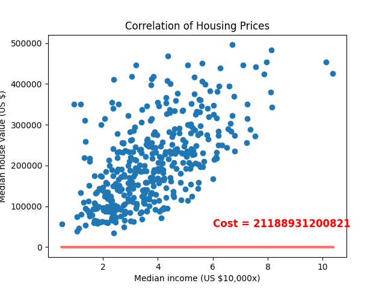

# Table of Contents

1.  [TODO List](#todo)
2.  [Contents - What is in each file?](#contents)
3.  [Summary - The gist of it.](#summary)
4.  [Technical Explanation - The nitty-gritty details.](#technical)
    1.  [Feature Scaling](#scaling)
    2.  [Mathematical Explanation](#maths)
        1.  [Symbols used](#symbols)
        2.  [Hypothesis](#hypothesis)
        3.  [Cost Function](#cost)
        4.  [Gradient Function](#gradient)
        5.  [Update rule](#update)

# TODO List

-   Verify all formulas.
-   Infinite answers via a totally vertical dataset.
-   Conclusion.
-   Hyperlink to LinkedIn & invitation to connect.
-   Hyperlink to Medium article & invitation to "clap", comment and follow.

# Contents - What is in each file?

-   [./housing.csv](./housing.csv) - Source: [California Housing Prices 1990](https://www.kaggle.com/datasets/camnugent/california-housing-prices/versions/1?resource=download) (Kaggle)
-   [./linear_regression.py](./linear_regression.py) - Implementation of Gradient Descent.
-   [./example.ipynb](./example.ipynb) - Example of how the above code is used in practice.

# Summary - The gist of it.

An implementation of gradient descent to solve the Linear Regression problem
*(Also known as Least Mean Squares and the Widrow-Hoff learning rule)*.

This can be used as supplementary teaching material.
The code is designed in such a way that it mimics the raw, underlying mathematics.
My personal opinion is that **the mathematic formulas provide a better explanation** of the mechanics.
However, the code may also be used as learning material.

Additionally, the user can manually iterate through training steps of the model using `LinearRegression.Iterate()`.
If the user combines this by manually calling `LinearRegression.Hypothesis()` and `LinearRegression.Cost()`,
they are able to plot the current hypothesis, and generate animations showing each training step.
Below, I demonstrate this. **Notice how quickly the model converges** to an approximate solution,
before tightening into the global solution.

<i>Figure 1. Least Mean Squares visualized.</i>

# Technical Explanation - The nitty-gritty details.

## Feature Scaling

It is important to begin with, and address the necessity for feature scaling through means of *normalization or standardization*.
**When implementing any gradient-based model, the features should be scaled.**
Figure one demonstrates that features have varying range. In the example; The range of *Median Income* is approximately 0 to 10.
In contrast, *Median House Value* has a range of approximately 0 to 500,000.

This makes selecting a learning rate difficult because we must choose a *miniscule* value.
Now imagine if we had another feature between -1 and 1.
Descending the gradient of this other feature becomes problematic.
We find ourselves descending it at a snail's pace.

**By scaling our features, it makes our loss function easier to descend.**

Supplementary material: [The Importance of Feature Scaling *("Bad" Feature)*](https://towardsdatascience.com/gradient-descent-the-learning-rate-and-the-importance-of-feature-scaling-6c0b416596e1#931e) - Daniel Godoy (Medium)

*Note that in the file `example.ipynb` I don't implement any scaling.
This is bad practice, but it helps to make my example much more easy to read.*

## Mathematical Explanation

In this section; **phrases denoted in bold** are technical terms that may need extra research.
They are highlighted for your ease of understanding.

Supplementary material: [Gradient Descent, Step-by-Step](https://www.youtube.com/watch?v=sDv4f4s2SB8) - Stat Quest with Josh Starmer (YouTube)

### Symbols used

-   $x$ - Referring to the entire training set.
-   ${x^{(i)}}$ - Referring to the $i$th data point in the training set.
-   ${x_j ^{(i)}}$ - Referring to the $j$th feature of the $i$th data point.
-   $N$ - The total number of training data points.
-   $F$ - The total number of features.

### Hypothesis

    def Hypothesis(self, data_point):
      '''
      Calculate the predicted value for datapoint "data_point".
      data_point is a 1-dimensional vector of len(params) - 1.
      '''
      sum = self.params[-1]
      for j in range( len(self.params) - 1 ):
          sum += self.params[j] * data_point[j]
      return sum

This refers to the current approximated solution.
In this case, it is simply a form of the classic **linear function** that we all learned in school.

$y = ax + b$

<i>Formula 1. Revising the classic linear function.</i>

But we use our fancy-pancy symbols instead. Note that the structure is the same.

$h(x^{(i)}) = \theta_{-1} + \theta_0 x^{(i)}_0 + \theta_1 x^{(i)}_1 ... \theta_n x^{(i)}_n$

$h(x^{(i)}) = \displaystyle\sum_{j=0}^{F-1} (\theta_j x^{(i)}_j) + \theta_{-1}$

<i>Formula 2. A more generic linear function; enabling an arbitrary number of features.</i>

### Cost Function

    def Cost(self):
        '''
        Least squared residuals cost function.
        '''
        sum = 0
        for i in range(len(self.__X)):
    	sum += (self.Hypothesis(self.__X[i,:]) - self.__Y[i])**2
        return sum

The cost function is a **sum of squared residuals (RSS)**.
This simply measures the distance between the hypothesis $h(x^{(i)})$ and true value $y^{(i)}$.
Then the result is squared to ensure a positive value.

\begin{equation}
J(x) = \displaystyle\sum_{i=0}^{N-1} ( h(x^{(i)}) - y^(i) )^2
\end{equation}

<i>Formula 3. Sum of squared residuals cost function.</i>

### Gradient Function

    def __Gradient(self, j, X, Y):
      '''
      Partial derivative of cost function (Least Squared Residuals)
      with respect to params[j]
    
      X, Y = Training data
      '''
      sum = 0
      for i in range( len(self.__X[:,0]) ):
          sum += 2 * (self.Hypothesis(self.__X[i,:]) - self.__Y[i]) * \
    	  (1 if j == -1 else self.__X[i,j]) # params[-1] is a special case and doesn't have a matching X.
      return sum

The gradient refers to all the **partial derivatives** of $J(x)$ with respect to $\theta_j$.

\begin{equation}
\frac{\partial}{\partial \theta_j} J(x) = \displaystyle\sum_{i=0}^{N-1} ( 2x_j^{(i)}( h(x^{(i)}) - y^{(i)} ) ) , x_{-1}^{(i)} = 1
\end{equation}

<i>Formula 4. Gradient of (Linear Regression) cost function.</i>

### Update rule

    def Iterate(self, learning_rate=0.001):
      '''
      Train the model one step at a time.
      '''
      for j in range( -1, len(self.params) - 1 ):
          change = learning_rate * self.__Gradient(j, self.__X, self.__Y)
          self.params[j] -= change

The update rule is called **Least Mean Squares (LMS)**.
It is also known as the Widrow-Hoff learning rule.
This is where the "learning" really happens, and *the parameters get updated with better values*.
Note that $:=$ just refers to a computational re-assignment of the left-hand value.

\begin{equation}
\theta_j := \theta_j - \alpha \frac{\partial}{\partial \theta_j} J(x)
\end{equation}

<i>Formula 5. Least Mean Squares update rule. Where the magic happens.</i>

